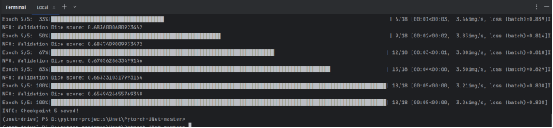
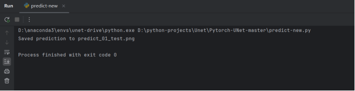
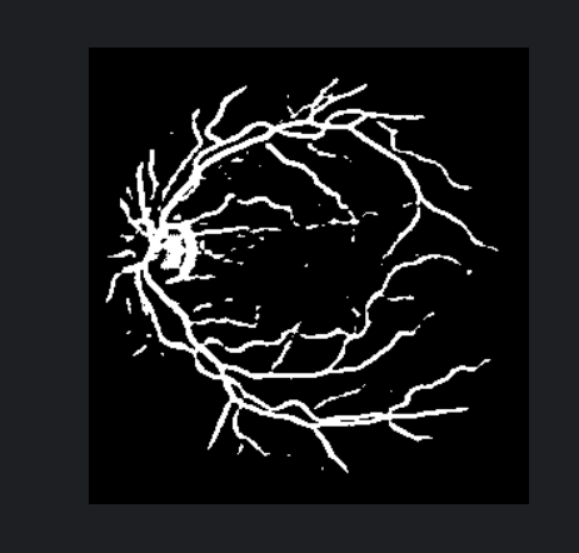

# U-Net on DRIVE Dataset（本地训练与推理完整复现）

本项目基于 **PyTorch 官方 U-Net 实现**，在 **DRIVE 视网膜血管分割数据集**上，完整复现了从 **环境配置 → 数据预处理 → 模型训练 → 推理预测** 的全过程，支持 **CUDA + AMP 混合精度训练**，适用于 Windows 本地 GPU 环境。

---

## 1. 项目概述

- **任务类型**：医学图像语义分割（视网膜血管）
- **模型结构**：U-Net
- **数据集**：DRIVE Dataset
- **输入**：RGB 视网膜图像（`.tif`）
- **输出**：二值分割掩码（0 / 255）
- **训练方式**：AMP 混合精度（`--amp`）

---

## 2. 环境配置

### 2.1 创建并激活 Conda 环境

```bash
conda create -n unet-drive python=3.9 -y
conda activate unet-drive
```

### 2.2 使用 conda 安装底层依赖（推荐）

```bash
conda install pytorch=2.1.2 torchvision=0.16.2 pytorch-cuda=11.8 numpy=1.23.5 pillow=9.3.0 matplotlib=3.6.2 -c pytorch -c nvidia -y
```

### 2.3 使用 pip 安装纯 Python 包

```bash
pip install tqdm==4.64.1 pyyaml
```

### 2.4 禁用 wandb

```bash
setx WANDB_DISABLED true
```

---

## 3. 环境验证

```bash
python - << EOF
import torch, torchvision, numpy, PIL
print("torch:", torch.__version__)
print("torchvision:", torchvision.__version__)
print("numpy:", numpy.__version__)
print("cuda:", torch.cuda.is_available())
EOF
```

---

## 4. 数据集处理（DRIVE → U-Net）

### 4.1 数据处理脚本

```python
import os
from PIL import Image

SRC_ROOT = r"D:/Users/111/Downloads/datasets/training"
SRC_IMG = os.path.join(SRC_ROOT, "images")
SRC_GT  = os.path.join(SRC_ROOT, "1st_manual")

DST_IMG = "data/imgs"
DST_GT  = "data/masks"

os.makedirs(DST_IMG, exist_ok=True)
os.makedirs(DST_GT, exist_ok=True)

for img_name in os.listdir(SRC_IMG):
    if not img_name.endswith(".tif"):
        continue

    Image.open(os.path.join(SRC_IMG, img_name))          .save(os.path.join(DST_IMG, img_name))

    gt_name = img_name.replace("_training.tif", "_manual1.gif")
    gt = Image.open(os.path.join(SRC_GT, gt_name)).convert("L")
    gt.save(os.path.join(DST_GT, img_name.replace(".tif", ".png")))

print("DRIVE training data prepared for UNet.")
```

---

## 5. 训练命令

```bash
python train.py --epochs 5 --batch-size 1 --classes 1 --amp
```

---

## 6. 推理

请参考项目内 `predict-new.py`。

---

## 图片占位

- 训练结束图  

- 推理过程图

- 推理结果图  

